# Maison Noir - Fine Dining Restaurant

A ReactJS frontend web application for Maison Noir, a fictional fine dining restaurant in Beirut, Lebanon. This project is Phase 2 of the Web Programming course project, building upon the static HTML/CSS site from Phase 1.

🔗 **GitHub Repository**: [diaahamdan112006/-maison-noir-react](https://github.com/diaahamdan112006/-maison-noir-react)

## Project Description

Maison Noir is a luxury fine dining restaurant website featuring French-Lebanese cuisine. The website showcases the restaurant's story, menu, gallery, and provides online reservation functionality.

## Technologies Used

- **ReactJS 19** - Frontend library
- **Vite 5** - Build tool and dev server
- **React Router DOM 7** - Client-side routing
- **Tailwind CSS 4** - Utility-first CSS framework
- **Git** - Version control

## Phase 1 to Phase 2 Migration (HTML to JSX)

### How the Migration Works

The original Phase 1 project consisted of static HTML files:
- `html/index.html` → Home page
- `html/menu.html` → Menu page
- `html/about.html` → About page
- `html/gallery.html` → Gallery page
- `html/contact.html` → Contact page

In Phase 2, these were converted to React JSX components:

| Phase 1 (HTML) | Phase 2 (React JSX) | Description |
|----------------|---------------------|-------------|
| `html/index.html` | `src/pages/Home.jsx` | Home page with hero, signature dishes, quote, hours |
| `html/menu.html` | `src/pages/Menu.jsx` | Full menu with starters, mains, desserts, wine |
| `html/about.html` | `src/pages/About.jsx` | Restaurant story, awards, chef bio, philosophy |
| `html/gallery.html` | `src/pages/Gallery.jsx` | Photo gallery with categories |
| `html/contact.html` | `src/pages/Contact.jsx` | Contact info and reservation form |

### Component Structure

```
src/
├── components/
│   ├── Navbar.jsx          # Navigation bar (from all HTML files' <nav>)
│   └── Footer.jsx          # Footer section (from all HTML files' <footer>)
├── pages/
│   ├── Home.jsx            # Home page component
│   ├── Menu.jsx            # Menu page component
│   ├── About.jsx           # About page component
│   ├── Gallery.jsx         # Gallery page component
│   └── Contact.jsx         # Contact page component
├── App.jsx                 # Main app with routing
├── main.jsx                # Entry point
└── index.css               # Tailwind CSS and theme variables
```

### Key Differences: HTML vs JSX

**1. Navigation (HTML to React Router)**
```html
<!-- Phase 1: Static links in each HTML file -->
<a href="index.html">Home</a>
<a href="menu.html">Menu</a>
```

```jsx
// Phase 2: React Router Link components in Navbar.jsx
<Link to="/">Home</Link>
<Link to="/menu">Menu</Link>
```

**2. Shared Components (DRY Principle)**
- Phase 1: Navbar and Footer were copied in each HTML file
- Phase 2: Navbar and Footer are separate components used in `App.jsx`

**3. Styling (CSS to Tailwind)**
```css
/* Phase 1: Separate CSS files */
.navbar { background: #1a1a1a; color: #f5f5f5; }
```

```jsx
// Phase 2: Tailwind utility classes
<nav className="bg-primary text-accent">
```

**4. State Management (Contact Form)**
```html
<!-- Phase 1: Static form, no interactivity -->
<form id="booking-form">
```

```jsx
// Phase 2: React state for form submission
const [submitted, setSubmitted] = useState(false)
const handleSubmit = (e) => { e.preventDefault(); setSubmitted(true) }
```

## Features

- **4+ Pages**: Home, Menu, About, Gallery, Contact
- **Responsive Design**: Works on desktop, tablet, and mobile
- **Client-Side Routing**: Fast page transitions without reload
- **Interactive Reservation Form**: State-managed form submission
- **Reusable Components**: Navbar and Footer shared across pages

## Setup Instructions

1. Navigate to the project directory:
```bash
cd "maison-noir-react"
```

2. Install dependencies:
```bash
npm install
```

3. Start the development server:
```bash
npm run dev
```

4. Open `http://localhost:5173` in your browser

## Available Scripts

- `npm run dev` - Start development server
- `npm run build` - Build for production
- `npm run preview` - Preview production build locally

## Deployment

The site is deployed on **GitHub Pages**:
🔗 [https://diaahamdan112006.github.io/-maison-noir-react/](https://diaahamdan112006.github.io/-maison-noir-react/)

## Git Commit History

The project uses Git for version control. View commit history:
```bash
git log --oneline
```

## Screenshots

### Home Page
The landing page features a full-screen hero with a call-to-action, signature dishes section, chef quote, and opening hours & location.

<div align="center">
  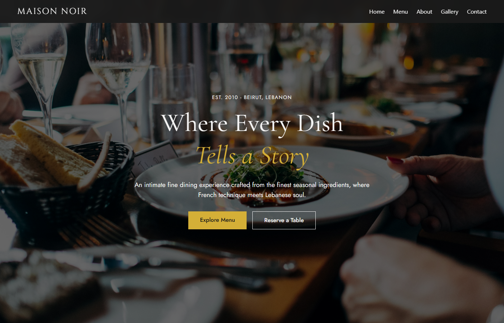
  <br/><br/>
  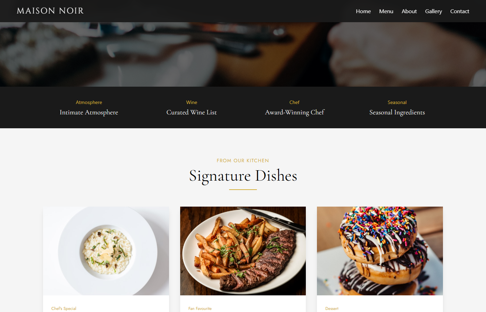
  <br/><br/>
  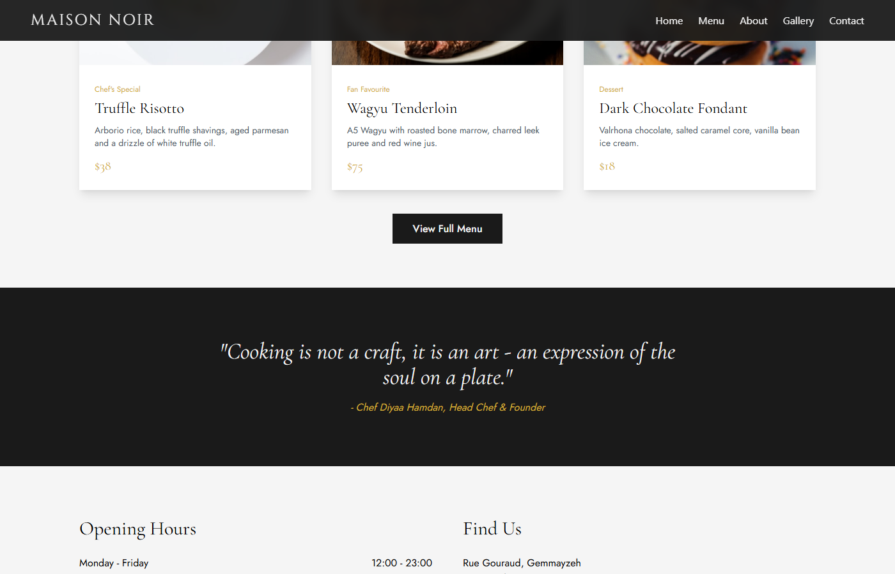
</div>

### Menu Page
The full menu organized into Starters, Mains, Desserts, and Wine Selection with pricing and dietary tags.

<div align="center">
  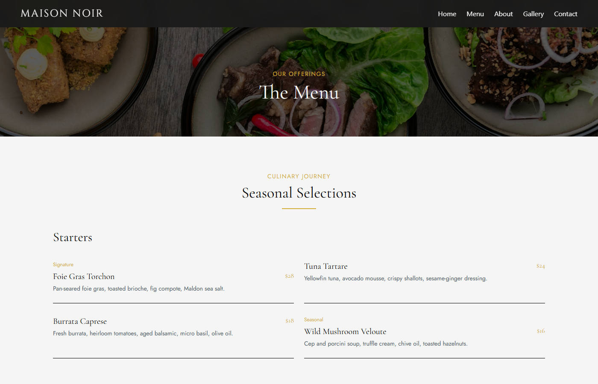
  <br/><br/>
  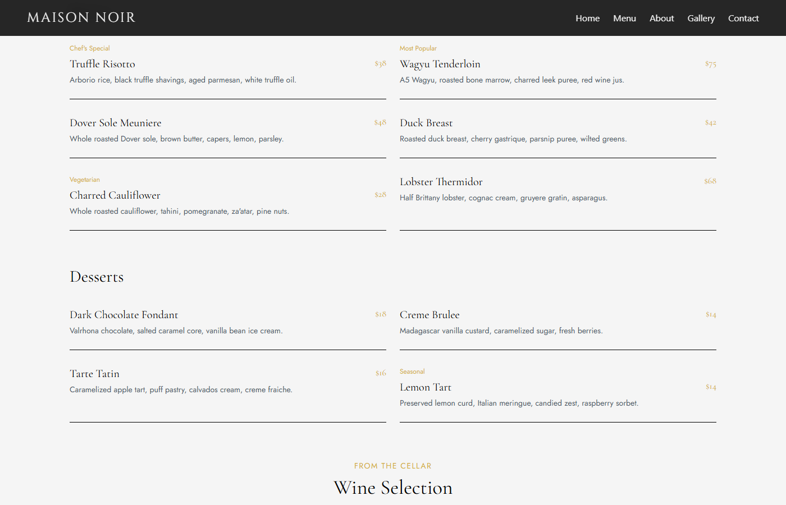
</div>

### About Page
The restaurant's story, accolades, chef profile, and kitchen philosophy on local sourcing and sustainability.

<div align="center">
  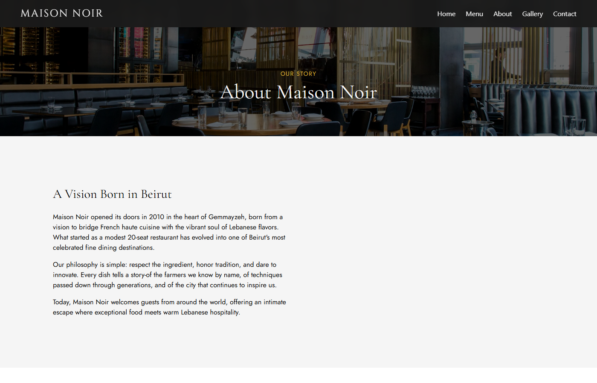
  <br/><br/>
  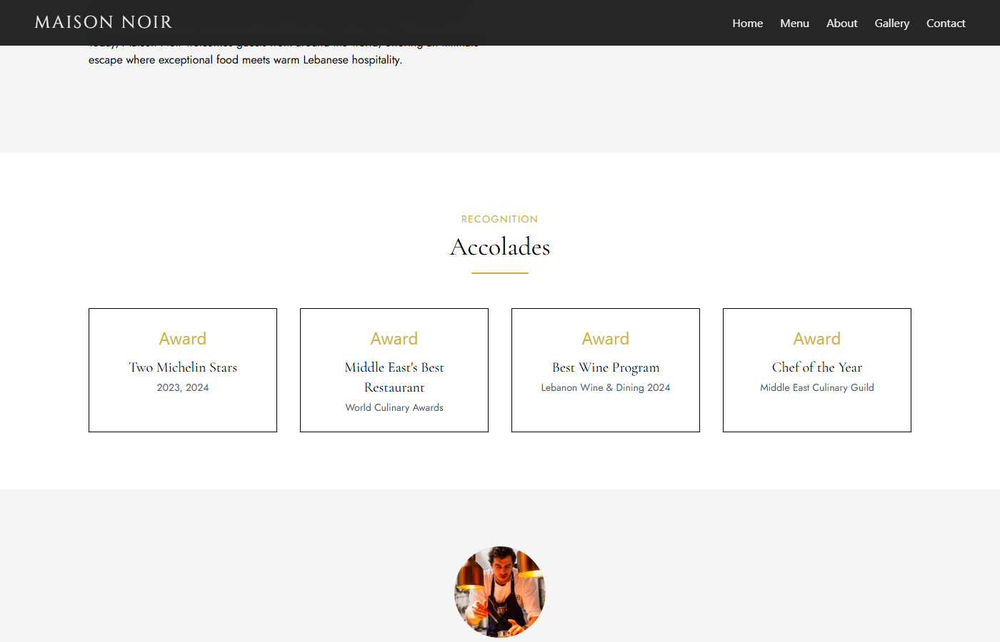
  <br/><br/>
  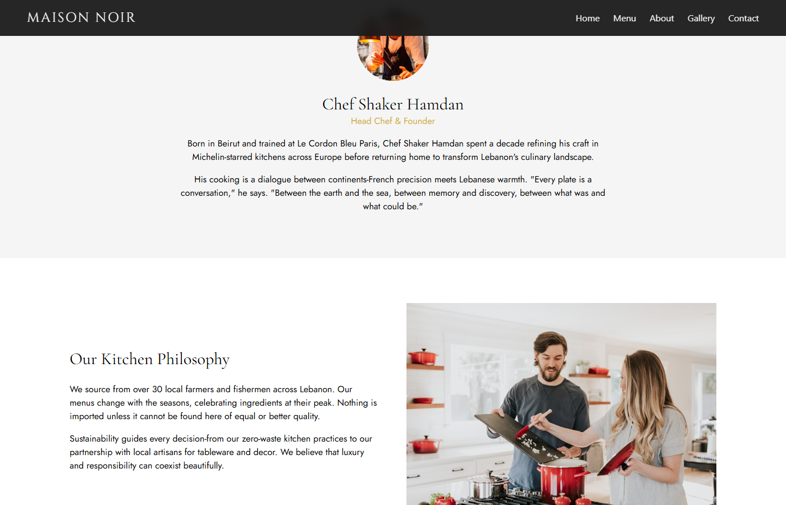
</div>

### Gallery Page
A visual showcase organized into three categories: Our Dishes, Our Restaurant, and Behind The Scenes.

<div align="center">
  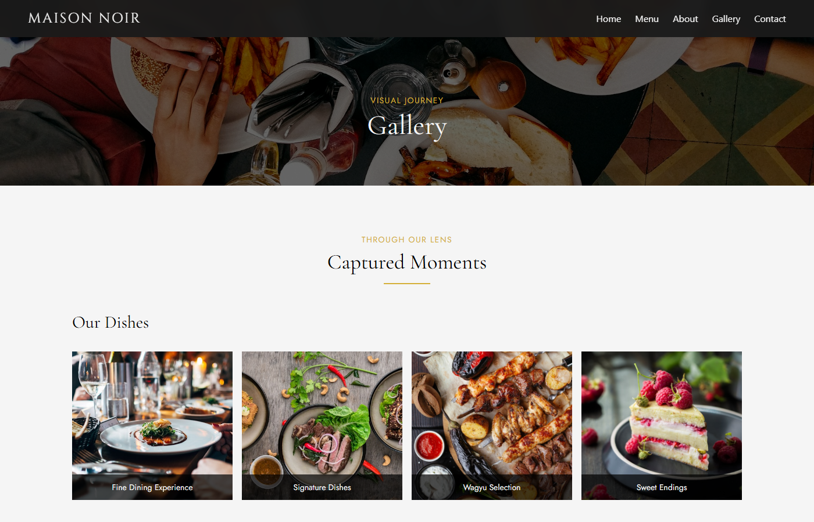
  <br/><br/>
  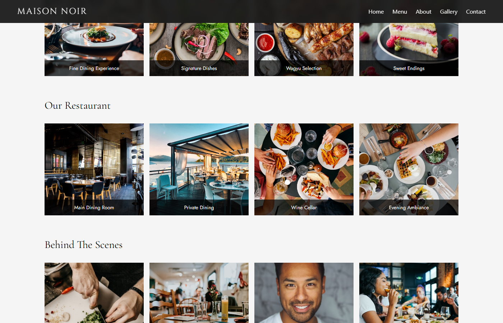
  <br/><br/>
  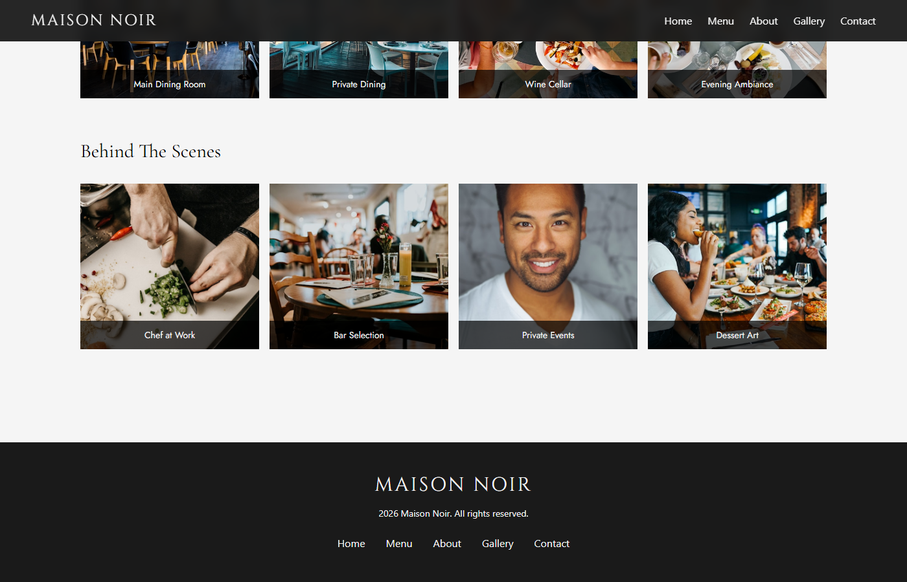
</div>

### Contact Page
Reservation form with fields for name, email, phone, date, time, guests, and special requests. On submission, shows a confirmation message.

<div align="center">
  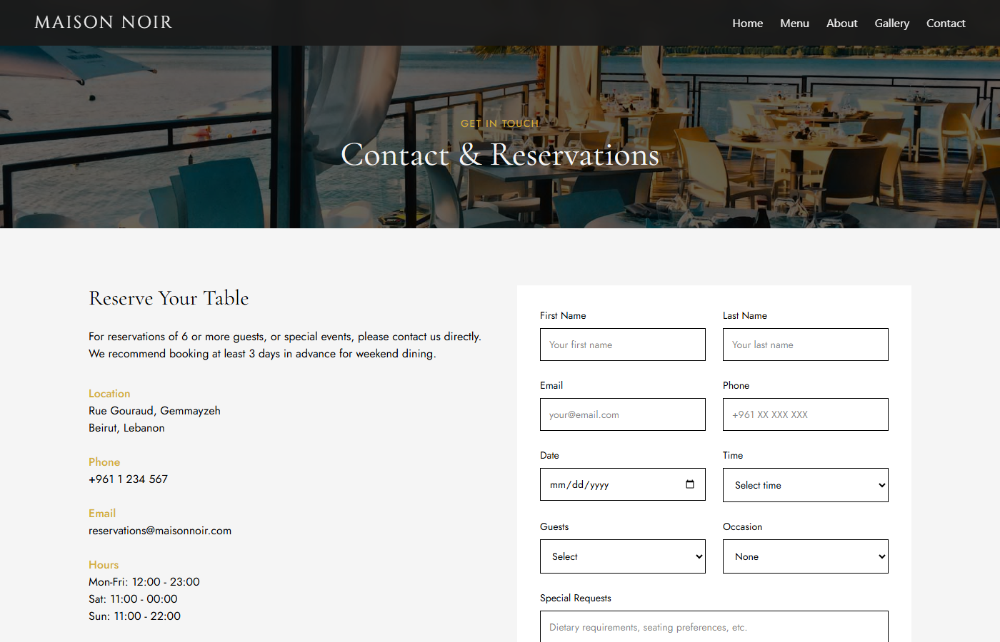
</div>
